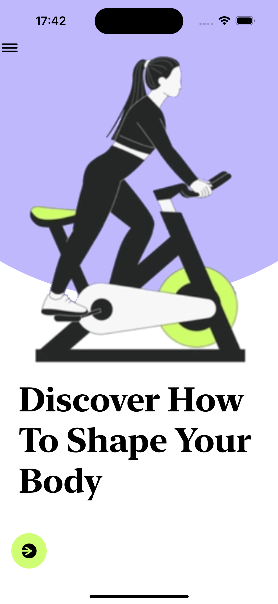
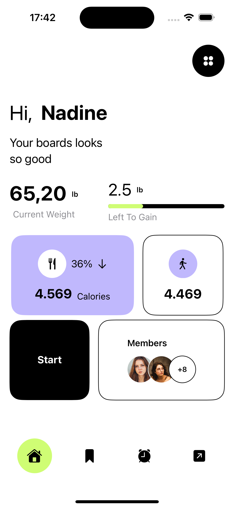
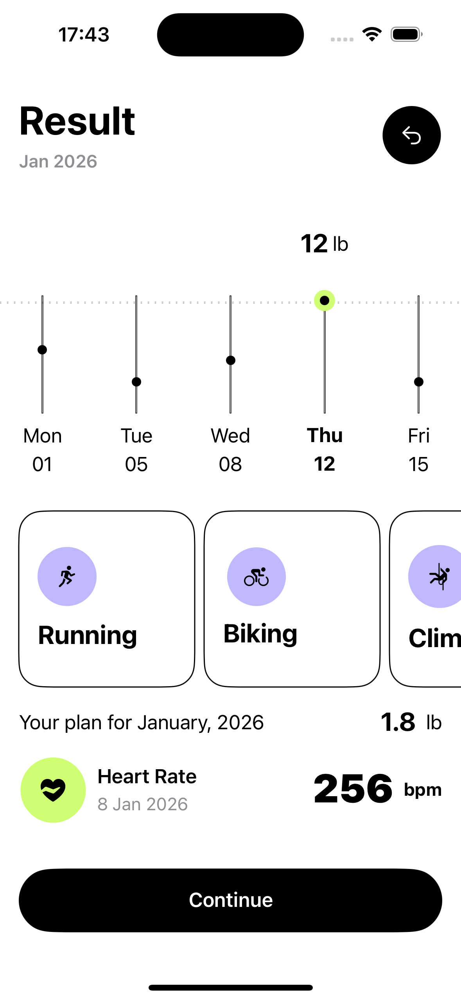

# 🧍‍♂️ BodyShape App – UI (SwiftUI)

**BodyShape App** is a **UI-only SwiftUI project** that showcases a clean and modern interface for a body-shape related application.  
This repository focuses **only on the user interface layer**, without any business logic, networking, or data processing.

---

## Demo
<div align="center">
  <table>
    <tr>
      <td align="center">
        
      </td>
      <td align="center">
        
      </td>
      <td align="center">
        
      </td>
    </tr>
    <tr>
      <td align="center" colspan="3">
        <sub>iPhone</sub>
      </td>
    </tr>
  </table>
</div>

---

The app consists of **three main views**:
- Splash View
- Dashboard View
- Result View

---

## ✨ Features

- 🎨 Modern, clean SwiftUI design
- 🧩 Modular, reusable UI components
- 🧱 Well-structured SwiftUI views
- ⚡ Fast and lightweight (UI only)

---

## 🧰 Tech Stack

| Category | Technology |
|--------|------------|
| **Language** | Swift |
| **Framework** | SwiftUI |
| **Architecture** | UI-layer only |
| **Platform** | iOS |
| **IDE** | Xcode |
| **Minimum iOS** | iOS 17+ |

---

## 📌 Project Overview

This project is intended as a **UI prototype / design implementation**.  
It does **not** include:
- Networking
- Backend integration
- Business logic
- Persistent storage

It can be used as:
- A UI reference
- A starting point for a full application
- A portfolio/demo project

---

## 📱 Screens

### 1️⃣ Splash View
- Initial launch screen
- Displays branding and app identity
- Acts as an entry point to the app

### 2️⃣ Dashboard View
- Main UI screen
- Displays user input options and primary actions
- Designed for easy extension with real data

### 3️⃣ Result View
- Displays calculated or predicted results (UI only)
- Focuses on visual clarity and hierarchy
- Ready for integration with real logic

---

## 🚀 Getting Started

### 1️⃣ Clone the Repository

```bash
git clone "https://github.com/HamedKharazmi1990/BodyShapeApp"
cd BodyShapeApp
```

### 2️⃣ Open the Project

    1. Open BodyShapeApp.xcodeproj in Xcode
    2. Select an iPhone simulator
    3. Choose the screen you want to run and put it in the BodyShapeAppApp file
    4. Press Run (⌘R)

### 📱 Supported Platforms
| Platform | Support |
|--------|------------|
| **iPhone** | ✅ |
| **iPad** | ✅ |

### 🎨 Design Notes

    Built entirely with SwiftUI

    Uses:
        - Stacks (VStack, HStack, ZStack)
        - Custom reusable components
        - Consistent spacing and typography
    Designed to be easily extended when logic and data layers are added


### 👨‍💻 Maintainer

    Hamed Kharazmi
    📧 hamed.kharazmi@gmail.com


    
